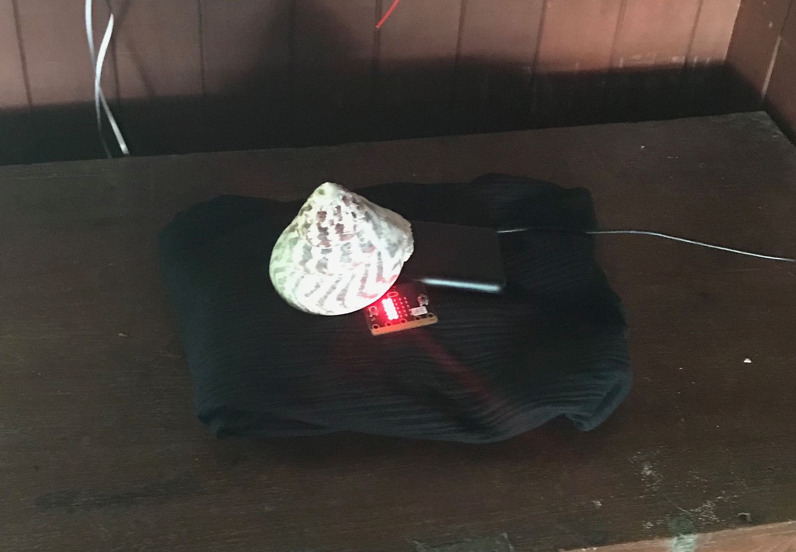

# DinaCrab: Shy Crabs and Humans built on Microbits

## Margaret Minsky & Oliver Steele

##July 2018

Project realization at Dinacon:

<!---->

When humans are near, making noise or stomping on the ground or rippling the intertidal waters, our crab retracts swiftly into its shell and only a little bit of claw can be seen:

When the humans back away, and stay quiet and still, our crab comes out and waves its claws about, testing that it has a peaceful environment again, and then gets on with its business of scrabbling about looking for food or patrolling its space:

Who is our crab? 

We have been taken with the hermit crabs of Koh Lon, their big personalities (from an anthropomorphic perspective) and varied looks and behaviours (from an ethological/naturalist perspective). Throughout their lives they move to ever larger colorful shells, from compact round snail houses to pointy or gracefully ovoid ones. They come out to the beach in diverse-looking groups because of their differences in size, shell type, and claw colors. If you get close, they snap into their shells, a little patience and distance and they are eager to get on with their business while we are watching.

Another crab, the fiddler crab, was one of the first dramatic animals we met. On our first evening we walked on a huge intertidal expanse exposed by a full moon tide, and the bright orange of swarms of fiddler crabs were dramatic. But as soon as one gets close, one's footfalls, water disturbances, or shadows alert the fiddler crabs who all pop into their holes in the coral or sand. As they disappear one sees their bright orange claws, and then nothing. Only quite a bit of distance or perfect stillness from the humans gives them a safe time to come back out.

*Placeholder: put edited video here from DaniMark 009 or the Andy's*

We simplified my (Margaret's) orginal wearables Dinacon project concept to collaborate on creating "humans" and "crabs" animated on Microbit boards, which felicitously have cute orange-red displays on board suitable for crab claws! We installed one of our crabs in a mighty shell, and let Dinasaurs carry  human boards and other crab boards around with them.  Using the Microbit's packet radio capability as a quick, though not very accurate or precise, ranging technology, crabs can tell whether there is any human nearby. As soon as any human gets in range, it snaps into its shell, leaving just a claw visible (like a hermit crab's visible armored claw blocking it's shell opening). As soon as all humans are far enough away, the shy crab comes back out waving its claws about.

Using the packet ranging for interactivity between creatures was inspired by a lovely and extensive dance performance interaction project by Emily Daub, her student capstone project at the ATLAS Center at CU-Boulder. We are grateful for her inspiration, and for help from Emily and  her student colleague Annie Kelly. 

Creating the animation of the crab claws, in my happy place near the sewing/textile/yarn corner. Microbit universe in an egg crate. 

Oliver and I collaborated on programming for the crab/human existence and interactions. We used the microbit/microsoft  blocks-language interface to its Typescript language (Javascript). Oliver built up a test suite for packet radio ranging in textual Typescript as well. I built several wearable versions of the boards using various batteries and sewn wearable holders, then ended up simplifying to hand-carrying the lightweight boards with simple enclosed battery pak. I also decided on an indoor installation space for our largest crab. For the humans, it feels like walking on the beach while carrying a rock or shell one might have picked up. For the crabs, is that like carrying a shell? No idea...

This is most of the blocks code for the main interactivity. It supports as many "crab" and "human" boards as you want, we had four at Dinacon. Usually configured as one crab, three humans, sometimes two crabs two humans.

Any questions contact me!

*photo of hermit crab uncredited stock photo Dreamstime.com*

